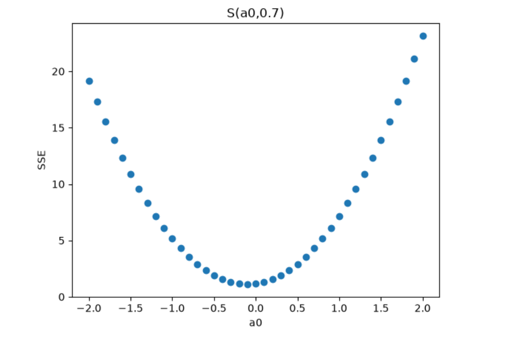
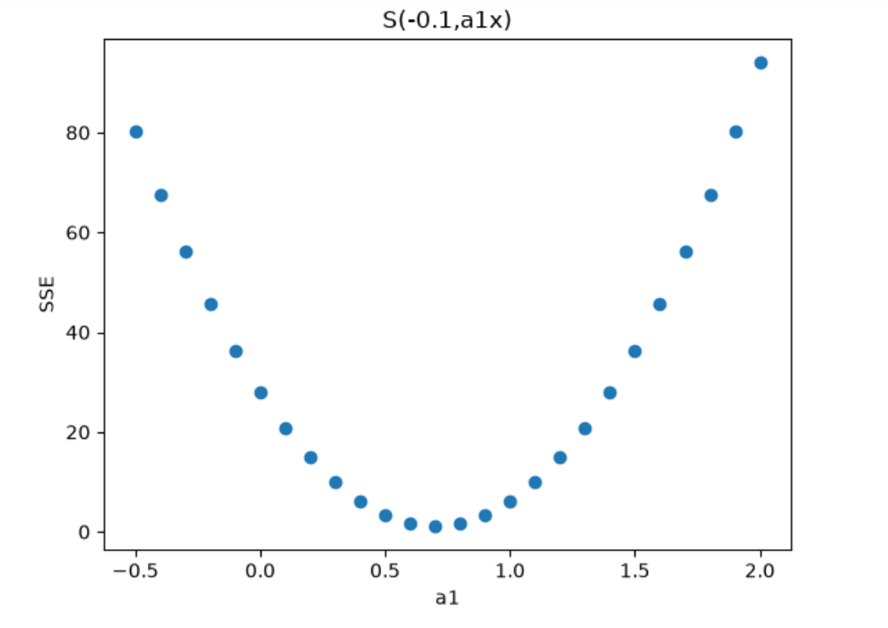
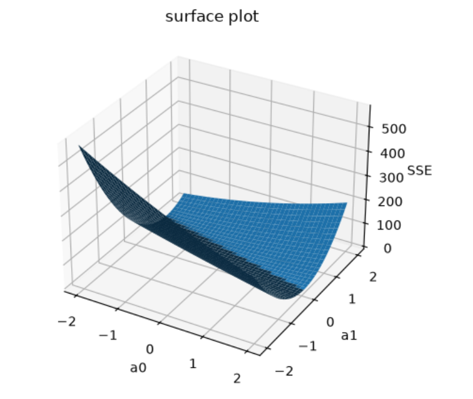

# Visualizing the Sum of Squared Errors (SSE) in Linear Regression

This repository contains three Python programs that visualize how the **Sum of Squared Errors (SSE)** changes with different parameters of a simple linear regression model.

The projects demonstrate:

1. **Fixed Slope (a₁ = 0.7)** – SSE vs. Intercept (a₀)
2. **Fixed Intercept (a₀ = -0.1)** – SSE vs. Slope (a₁)
3. **Varying Intercept and Slope** – 3D SSE Surface (Paraboloid)

These visualizations help explain how the cost function behaves and why optimization algorithms such as **Gradient Descent** search for the minimum value of the error surface.

---

## Mathematical Model

The linear regression model is

$$
\hat{y}=a_0+a_1x
$$

where

- $a_0$ = Intercept
- $a_1$ = Slope
- $\hat{y}$ = Predicted value

The Sum of Squared Errors (SSE) is calculated as

$$
S(a_0,a_1)=\sum_{i=0}^{m-1}(y_i-\hat{y}_i)^2
$$

or

$$
S(a_0,a_1)=\sum_{i=0}^{m-1}\left(y_i-(a_0+a_1x_i)\right)^2
$$

Dataset used in all programs:

```python
x = [1, 2, 3, 4, 5]
y = [1, 1, 2, 2, 4]
```

---

# 1. Fixed Slope (a₁ = 0.7)

The slope is fixed at **0.7**, while the intercept **a₀** is varied.

The program calculates the SSE for different values of **a₀** and generates a scatter plot of **SSE vs. a₀**.

### File

```
fixed_a0.py
```

### Output

<p align="center">
  
</p>

---

# 2. Fixed Intercept (a₀ = -0.1)

The intercept is fixed at **-0.1**, while the slope **a₁** is varied.

The program calculates the SSE for different values of **a₁** and generates a scatter plot of **SSE vs. a₁**.

### File

```
fixed_a1.py
```

### Output

<p align="center">
  
</p>

---

# 3. Varying Intercept and Slope

Both **a₀** and **a₁** are varied simultaneously.

The program computes the SSE for every combination of the two parameters and visualizes the resulting cost function as a **3D surface plot (paraboloid)**.

### File

```
varying_a0_a1.py
```

### Output

<p align="center">
  
</p>

---

# Repository Structure

```text
.
├── fixed_a0.py
├── fixed_a1.py
├── varying_a0_a1.py
├── fix_a0.png
├── fix_a1.png
├── vary_a0-a1.png
└── README.md
```

---

# Requirements

- Python 3.x
- NumPy
- Matplotlib

Install the required libraries using:

```bash
pip install numpy matplotlib
```

---

# Learning Outcomes

This project demonstrates:

- Linear Regression
- Sum of Squared Errors (SSE)
- Cost Function Visualization
- Effect of Intercept on Error
- Effect of Slope on Error
- 3D Cost Surface (Paraboloid)
- Data Visualization using Matplotlib
